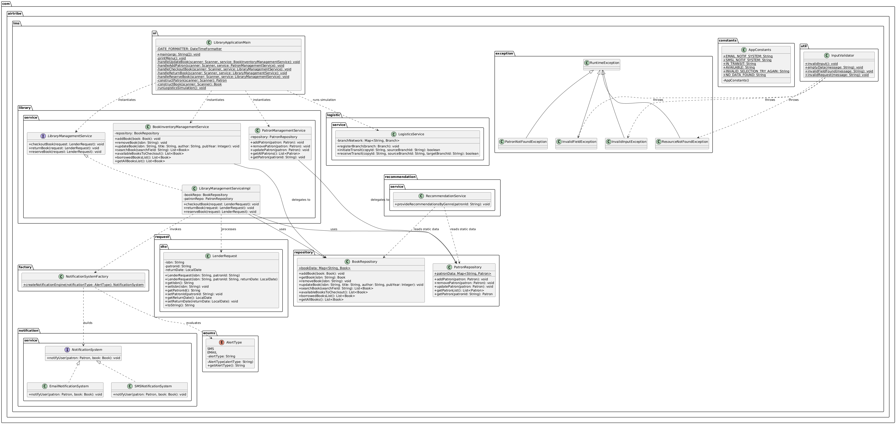

# Library Management System (LMS)

A modular, console-driven Library Management System implemented in **Java 8** and managed using **Maven**.The platform coordinates book inventories, patron records, priority-based reservation queues, localized branching logistics, and dynamic multi-channel user alerting configurations.

---
## 🏗️ System Architecture & Design Patterns

The codebase is structured around core clean-coding guidelines, explicit boundary separation, and proven design paradigms:

### 1. Creational Patterns
**Factory Method Pattern (`NotificationSystemFactory`):** Decouples client execution steps from explicit class instantiations. It dynamically abstracts over localized system alerting rules based on concrete enumeration definitions (`AlertType`).
* [cite_start]**Builder Pattern:** Implemented cleanly within the fundamental data models (`Patron`, `Book`, `BookCopy`) to enable flexible field configurations without relying on bloated constructors.

### 2. Behavioral Patterns
* **Strategy Pattern (`NotificationSystem`):** Encapsulates runtime notification behaviors cleanly across divergent technical alerting targets (`EmailNotificationSystem`, `SMSNotificationSystem`).

### 3. Layered Boundary Responsibilities
***Service Layer (`com.airtribe.lms.library.service`):** Contains pure transactional execution rules.LibraryManagementServiceImpl` controls domain processes (checking out, returning, reserving books) , while specialized managers deal explicitly with system entities.
**Data Isolation Layer (`com.airtribe.lms.repository`):** Uses thread-safe data layers (`ConcurrentHashMap`) or managed lookup tables to cleanly isolate static memory states away from transient operational workflows.

### 3. Observer pattern
***Service Layer (`com.airtribe.lms.library.service`):** trigger an event when an particular update happened on specific collection

---

## 🛠️ Technology Stack & Dependencies

* [cite_start]**Runtime Environment:** Java 8 (JDK 1.8)
* **Build Automation Tool:** Apache Maven
* **Testing Infrastructure:** JUnit 5 (Jupiter API & Engine `5.10.3`) paired with Mockito (`3.12.4`) for clean Java 8 compatibility.

---
## class diagram:


## 💻 Installation & Environment Setup

### 1. Clone & Navigate to Project
```bash
git clone <repository-url>
cd library-management-system
